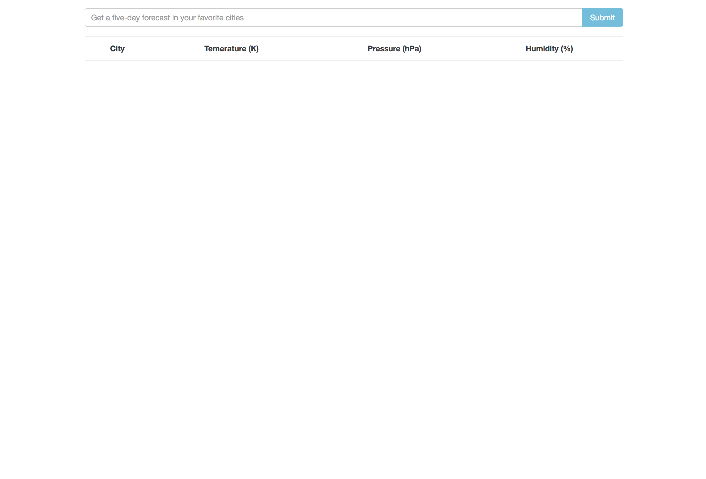
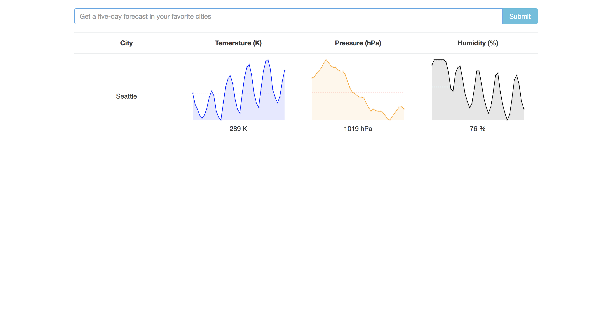
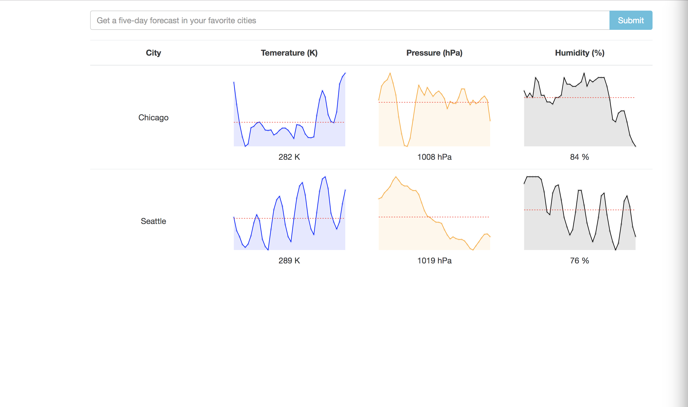

# 5 Day Weather App

#### By **Nanette Girzi**

## Description

Basic React/Redux application that shows the 5 day forecast (temp, pressure and humidity) for cities entered by the user.

_ Landing Page

_ Enter City

_ Enter Another City

## Setup/Installation Requirements

Run the following commands in Terminal:

* $ git clone
* $ cd WeatherApp
* $ npm install
* $ npm run start

## Known Bugs

No known bugs at this time.

## Support and contact details

If you have suggestions please email ngirzi@gmail.com

## Technologies Used

* React
* Redux
* CSS
* HTML
* Bootstrap
* Webpack

### License

*This software is licensed under the MIT license.*

Copyright (c) 2018 **Nanette Girzi**
